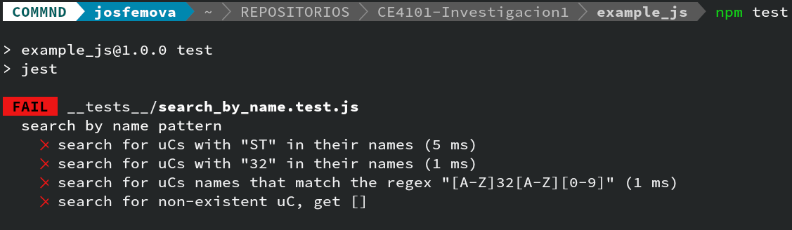
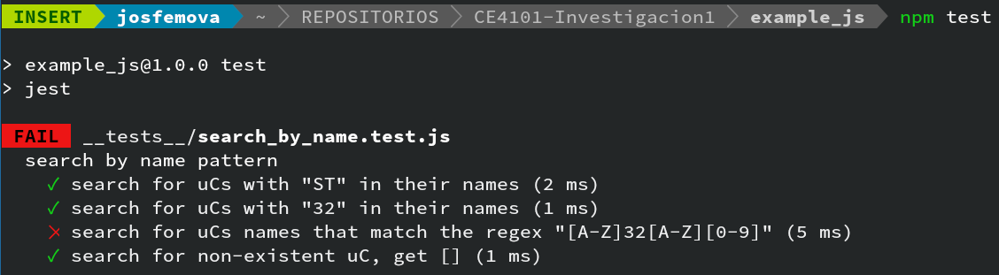
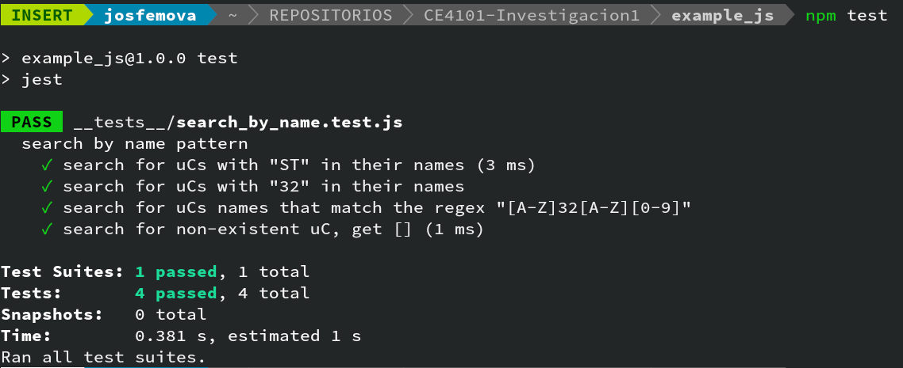

---
title: Instituto Tecnológico de Costa Rica\endgraf\bigskip \endgraf\bigskip\bigskip\
 Investigación 1 \endgraf\bigskip\bigskip\bigskip\bigskip
author: 
- José Morales Vargas, carné 2019024270
- Alejandro Soto Chacón, carné 2019008164
date: \bigskip\bigskip\bigskip\bigskip Area Académica de\endgraf Ingeniería en Computadores \endgraf\bigskip\bigskip\ Especificación y Diseño \endgraf de Software (CE4101) \endgraf\bigskip\bigskip Profesor Daniel Madriz Huertas \endgraf\vfill  Semestre I
header-includes:
- \setlength\parindent{24pt}
- \usepackage{url}
lang: es-ES
papersize: letter
classoption: fleqn
geometry: margin=1in
#fontfamily: sans
fontsize: 12pt
monofont: "Noto Sans Mono"
linestretch: 1.15
bibliography: bibliografia.bib
csl: ieee.csl
...

\maketitle
\thispagestyle{empty}
\clearpage
\tableofcontents
\pagenumbering{roman}
\clearpage
\pagenumbering{arabic}
\setcounter{page}{1}

# Unit testing

## Repositorio

Esta investigación involucraba la programación de dos pruebas de concepto.
El código fuente de dichas pruebas se puede encontrar en el siguiente enlace:

- <https://github.com/Josfemova/CE4101-Investigacion1>

## ¿Qué son las pruebas unitarias

La práctica de pruebas unitarias consiste en la prueba de unidades individuales
e software. Se usa el término unidad puesto que el objeto de prueba puede
variar desde unidades simples de funcionamiento a unidades más complejas, es 
decir, desde funciones hasta procedimientos que involucran varias unidades.

Este tipo de pruebas se realizan previo a otros tipos de pruebas para 
asegurarse de una correcta funcionalidad del código respecto a la funcionalidad
especificada. Su resultado, según [@agile-alliance-unit-test], es binario: la 
unidad pasa la prueba si la misma cumple con la funcionalidad especificada, o 
falla la prueba si no cumple con las expectativas. 

Las pruebas unitarias pueden ser una base para metodologías de desarrollo y 
diseño, por ejemplo, lo que [@agile-alliance-tdd] llama "Test driven 
development". Este es un acercamiento en el que se busca describir el como
funciona un programa por medio de pruebas unitarias antes de empezar a producir
el código del programa mismo. Esto impone un coste de tiempo inicial para la
definición y programación de las pruebas unitarias, sin embargo, su coste
inicial puede significar un ahorro de tiempo en la fase final de proyectos 
complejos. 

Las pruebas unitarias son un subset de el conjunto de pruebas de software en 
general. Lo anterior significa que varias de las categorías de clasificación
de pruebas se pueden encontrar en las pruebas unitarias, por ejemplo, las
referentes a _white box_ testing, _black box_ testing y _grey box_ testing, las
cuales se refieren al nivel de conocimiento sobre el funcionamiento interno de
la unidad bajo prueba. 

### Beneficios

Los beneficios son varios, por ejemplo, [@agile-alliance-tdd] y 
[@agile-alliance-unit-test] indican entre los beneficios:

- Disminución en la cantidad de defectos encontrados a costo de un mayor
  esfuerzo de desarrollo en las etapas iniciales.
- Disminución en el esfuerzo requerido en las etapas finales de desarrollo.
- Mejor calidad de diseño del código. 

Otras fuentes como [@geeks-for-geeks] señalan las siguientes ventajas:

- Permiten obtener un entendimiento de la funcionalidad provista por una API
  y su comportamiento esperado. 
- Permiten probar secciones de un programa sin necesidad de que el mismo ya se
  encuentre completado.


### Limitaciones

Las pruebas unitarias, sin bien son una herramienta poderosa, no deberían 
tomarse como la única herramienta a utilizar para verificar la funcionalidad
de un programa. Otros tipos de pruebas deben realizarse posteriormente, por 
ejemplo, las pruebas de integración. Otras desventajas, limitaciones y posibles
problemas son mencionados por [@geeks-for-geeks] y [@agile-alliance-tdd]:

- El proceso consume tiempo en la escritura de las pruebas.
- Si la especificación de la funcionalidad cambia, se debe refactorizar tanto
  la unidad bajo prueba como la prueba en sí, lo que implica mayor consumo de
  tiempo
- No puede cubrir los requisitos no funcionales del programa, tal como la 
  capacidad de escalar del sistema, su desempeño, etc.


## Ejemplo framework para pruebas unitarias en Java

Existen varias herrramientas para realizar pruebas en Java. Entre
ellas se encuentran:

 - JBehave: diseñada para desarrollo guiado por comportamiento.
 - Serenity: permite trabajar con otros frameworks de pruebas.
 - TestNG: está especializado en pruebas unitarias.
 - Muchas otras, incluyendo Selenide, Gauge, Geb, Spock, etc.

Posiblemente el framework más popular para realizar pruebas unitarias en Java
es JUnit. Esta biblioteca permite automatizar la ejecución de pruebas y
realizar desarrollo guiado por pruebas (TDD).

Algunas de las características de JUnit son:
 - Software libre y de código abierto bajo licencia MIT
 - Pruebas por medio de aserciones
 - Ejecución automática de pruebas
 - Organización y agrupación de pruebas individuales en test suites

### Funcionalidades

Las principales funcionalidades para realizar pruebas en JUnit las provee
clases que incluye:

 - `Assert`: contiene métodos para realizar aserciones, incluyendo:
  - `void assertEquals(boolean expected, boolean actual)`: afirma que dos valores sean iguales.
  - `void assertNotNull(Object object)`: afirma que cierto valor no es nulo.
  - `void assertNull(Object object)`: afirma que cierto valor es nulo.
  - `void assertTrue(boolean condition)`: afirma que cierta condición es verdadera.
  - `void assertFalse(boolean condition)`: afirma que cierta condición es falsa.

El principal mecanismo para realizar pruebas unitarias en JUnit es la clase
`Assert`. Al igual que en la mayoría de frameworks de pruebas unitarias, la
forma en la que se realiza una prueba es ejecutando alguna función que se desee
probar con cierta entrada, capturando su resultado, y comparándo ese resultado
con un valor que es correcto y esperado, dada la entrada que se utilizó. La
forma en la que se realiza esta comparación entre el resultado obtenido de una
función y un valor esperado es utilizando las funciones de aserción.

### Tipos de pruebas

Se pueden clasificar los componentes de una prueba en varias categorías,
listadas a continuación. JUnit está principalmente destinado a pruebas
unitarias y de integración.

#### Fixtures

Una *fixture* es un estado fijo que produce una base para ejecutar pruebas. El
propósito de esta clase es asegurar un ambiente conocido antes de ejecutar
pruebas, es decir, un tipo de ambiente conocido sobre el que se desean realizar
aserciones.

Esto se logra principalmente a través del método `setUp()`, el cual se ejecuta
antes de cada prueba. Además, existe el método `tearDown()`, que se ejecuta al
final de cada prueba y destruye el entorno de fixture.

#### Test suites
Una *test suite* agrupa cierta cantidad de pruebas unitarias y las ejecuta
juntas. Esto permite ejecutar pruebas por grupo, en lugar de individualmente.
Para esto, existen las anotaciones `@RunWith` y `@Suite`.

#### Test runner
Un *test runner* se utiliza como punto de entrada para ejecutar las pruebas. Es
una característica de extensibilidad.

### Ejemplo de uso

Para utilizar JUnit se siguen los siguientes pasos:
1. Se prepara el entorno de desarrollo. Es necesario JDK 1.5 o superior.
2. Se instalar JUnit, que está disponible en [@junit-gh] y varias distribuciones de software.
3. Se escribe una prueba (`TestJunit.java`):
```Java
import org.junit.Test;
import static org.junit.Assert.assertEquals;

public class TestJunit
{
   @Test
   public void pruebaBasica()
   {
      String str = "Prueba inicial";
      assertEquals("Prueba inicial", str);
   }
}
```
4. Se escribe un corredor (*test runner*) para la prueba (`TestRunner.java`):
```Java
import org.junit.runner.notification.Failure;
import org.junit.runner.JUnitCore;
import org.junit.runner.Result;

public class TestRunner
{
   public static void main(String[] args)
   {
      Result result = JUnitCore.runClasses(TestJunit.class);
      for(Failure failure : result.getFailures())
      {
         System.err.println(failure.toString());
      }

      System.out.println(result.wasSuccessful());
   }
}  
```
5. Se compilar y ejecuta la prueba, revisando posteriormente el reporte:
```Bash
$ javac TestJunit.java TestRunner.java
$ java TestRunner
true
```

Como se observa, hay un archivo en el que se define la prueba
(`TestJunit.java`) y otro archivo que ejecuta la prueba y funciona como punto
de entrada (`TestRunner.java`).

En el archivo de definición, `TestJunit.java`, se importan los paquetes
necesarios para realizar pruebas, se define una clase de pruebas y se declara
una función de prueba, utilizando la anotación `@Test`. En `TestJRunner.java`
se realizan las importaciones necesarias, se define una clase para correr las
pruebas, se declara una variable que contiene el resultado de las pruebas y,
para cada una de las pruebas, se imprime cada una de las pruebas que tuvo algún
error. Finalmente, se imprime si el resultado de las pruebas fue exitoso.

Se incluye un ejemplo más desarrollado a continuación (tomado de
[@junit-example]). `EmployeeDetails` es una clase que define la información de
un empleado de cierta empresa, incluyendo su nombre, edad y salario.

```Java
public class EmployeeDetails {

   private String name;
   private double monthlySalary;
   private int age;
   
   /**
   * @return the name
   */
	
   public String getName() {
      return name;
   }
	
   /**
   * @param name the name to set
   */
	
   public void setName(String name) {
      this.name = name;
   }
	
   /**
   * @return the monthlySalary
   */
	
   public double getMonthlySalary() {
      return monthlySalary;
   }
	
   /**
   * @param monthlySalary the monthlySalary to set
   */
	
   public void setMonthlySalary(double monthlySalary) {
      this.monthlySalary = monthlySalary;
   }
	
   /**
   * @return the age
   */
   public int getAge() {
      return age;
   }
	
   /**
   * @param age the age to set
   */
   public void setAge(int age) {
      this.age = age;
   }
}
```

`EmpBusinessLogic` es una clase que utiliza a `EmployeeDetails` ior para
calcular el salario de un empleado y también su aumento anual:
```Java
public class EmpBusinessLogic {
   // Calculate the yearly salary of employee
   public double calculateYearlySalary(EmployeeDetails employeeDetails) {
      double yearlySalary = 0;
      yearlySalary = employeeDetails.getMonthlySalary() * 12;
      return yearlySalary;
   }
	
   // Calculate the appraisal amount of employee
   public double calculateAppraisal(EmployeeDetails employeeDetails) {
      double appraisal = 0;
		
      if(employeeDetails.getMonthlySalary() < 10000){
         appraisal = 500;
      }else{
         appraisal = 1000;
      }
		
      return appraisal;
   }
}
```

Finalmente, `TestEmployeeDetails` prueba el funcionamiento correcto de las dos
clases anteriores por medio de una prueba unitaria de JUnit.
```Java
import org.junit.Test;
import static org.junit.Assert.assertEquals;

public class TestEmployeeDetails {
   EmpBusinessLogic empBusinessLogic = new EmpBusinessLogic();
   EmployeeDetails employee = new EmployeeDetails();

   //test to check appraisal
   @Test
   public void testCalculateAppriasal() {
      employee.setName("Rajeev");
      employee.setAge(25);
      employee.setMonthlySalary(8000);
		
      double appraisal = empBusinessLogic.calculateAppraisal(employee);
      assertEquals(500, appraisal, 0.0);
   }

   // test to check yearly salary
   @Test
   public void testCalculateYearlySalary() {
      employee.setName("Rajeev");
      employee.setAge(25);
      employee.setMonthlySalary(8000);
		
      double salary = empBusinessLogic.calculateYearlySalary(employee);
      assertEquals(96000, salary, 0.0);
   }
}
```

`TestRunner` es el punto de entrada y ejecuta la prueba:

```Java
import org.junit.runner.JUnitCore;
import org.junit.runner.Result;
import org.junit.runner.notification.Failure;

public class TestRunner {
   public static void main(String[] args) {
      Result result = JUnitCore.runClasses(TestEmployeeDetails.class);
		
      for (Failure failure : result.getFailures()) {
         System.out.println(failure.toString());
      }
		
      System.out.println(result.wasSuccessful());
   }
} 
```

Habría sido posible escribir la prueba y el runner primero si se deseara un
desarrollo dirigido por pruebas, situación en que software se escribe con tal
de satisfacer pruebas unitarias existentes. Se compila, ejecuta y se observa
la salida:

```Bash
$ javac EmployeeDetails.java EmpBusinessLogic.java TestEmployeeDetails.java TestRunner.java
$ java TestRunner
true
```

Se comprueba entonces que el sistema funciona según lo especificado en las
pruebas unitarias.

## Ejemplo framework para pruebas unitarias en JavaScript

En el ecosistema de JavaScript existen varias herramientas y frameworks para
pruebas unitarias. Algunas de estas herramientas están enfocadas a un flujo de 
trabajo específico, mientras que otras se adaptan a varios flujos e incluso
a lenguajes hermanos de JavaScript. Entre estos últimos se encuentra Jest, un
framework desarrollado por Facebook para realizar pruebas unitarias en una 
gran variedad de escenarios.

Si bien se puede notar una ligera preferencia por React, [@jest-guides] señala
diversos recursos para aprender a utilizar este framework de pruebas unitarias
con frameworks de desarrollo Web como AngularJS, Vue.js, Angular, MobX, Redux,
Express.js, GatsbyJS, Hapi.js y Next.js. 

### Funcionalidades

Jest hace uso del modelo de matchers, funciones de la API que permiten 
expresar los requisitos funcionales de una función con un lenguaje similar
al lenguaje natural. Hay matchers para:

- Matchers comunes: Comparaciones típicas de valores.
- Comparación de valores por "truthtiness": Básicamente permite diferenciar
  entre valores que se evalúan como falso y verdadero, así como los subsets de
  estos tipos.
- Comparación de tipos numéricos.
- Comparación y análisis de cadenas de caracteres.
- Comparación y descripción de características de arreglos y otros objetos
  iterables.
- Chequeo de tipo de errores.

Hay más matchers, pero estos incluyen los principales. 

Entre otras funcionalidades que se ofrecen son componentes de la API diseñados
especialmente para la prueba de código que se ejecuta de manera asincrónica. 
También ofrece capacidades de "mocking", desde la declaración de funciones mock
hasta unidades más grandes, tales como los módulos de JavaScript.

### Tipos de pruebas

Si bien oficialmente no existe como una separación de los tipos de pruebas que
ofrece este framework, los mismos se pueden separar en tres grandes grupos:

- Pruebas de funcionalidad sincrónica: Como lo señala el nombre, son pruebas en
  las que se comprueba un comportamiento de una unidad de código que se ejecuta
  de manera sincrónica.
- Pruebas de funcionalidad asincrónica: Son pruebas de funcionalidad para 
  funciones que se ejecutan de manera asincrónica. Por la naturaleza del código
  se debe recurrir a herramientas como _promises_, _async/await_ y _callbacks_.
  Debido a lo común que es la necesidad de probar este tipo de código en 
  JavaScript, Jest incluye un matcher específico para este tipo de pruebas. 
- Pruebas de enlaces entre unidades: [@jest-mock] describe el uso de mocks para
  probar la la interconexión entre distintos módulos sin la necesidad de 
  implementar el módulo que los conecta directamente. 

### Ejemplo de uso

Para mostrar como se usa Jest se mostrará un pequeño ejemplo corriendo en una 
aplicación simple de NodeJS. Para ambientar mejor, podemos decir que la 
aplicación a implementar es un servicio web que provee información sobre 
microcontroladores varios. 

La primera función a implementar es una función de búsqueda por nombre. Esta 
función tiene los siguientes requerimientos:

- Debe devolver una lista vacía si no obtiene resultados
- Debe ser capaz de buscar sub-cadenas que aparezcan en cualquier punto
  del nombre del dispositivo.
- Debe aceptar expresiones regulares.

Dada esta especificación, podemos proceder a configurar el proyecto base:

1. Se crea un directorio `ejemplo_js`
2. Se ejecuta `npm init` dentro de dicho directorio
3. Cuando pregunte por el comando de testing, escribir "jest"
4. Si no se ha instalado jest, lo puede instalar ejecutando
   ```Shell
   npm install --save-dev jest
   ```
5. Se crean las carpetas `__test__` y `search`.
6. Dentro de la carpeta `__test__` se crea el archivo que contendrá las pruebas
   correspondientes al método de búsqueda: `search_by_name.test.js`
7. Dentro de la carpeta `search` se crea el archivo `by_name.js` el cual 
   contendrá la implementación de la función a probar.

Dados estos primeros pasos se puede proseguir de forma más granular. Primero
que nada, se crea una definición vacía de la función `search_by_name` y se
exporta:

```JavaScript
function search_by_name(uc_data, pattern){
};

module.exports = {search_by_name};
```

Con esta información ya se puede pasar a definir las pruebas unitarias. Primero
se deben realizar las importaciones de módulos relevantes en 
`search_by_name.test.js`:

```JavaScript
const { describe, expect, test } = require('@jest/globals');
const { search_by_name } = require('../search/by_name');
```

Posteriormente se declara un set de datos de prueba:

```JavaScript
const uc_data = [
    { name: "STM32F3", vendor: "ST" },
    { name: "STM32F4", vendor: "ST" },
    { name: "STM32F7", vendor: "ST" },
    { name: "STM32H7", vendor: "ST" },
    { name: "ESP32S2", vendor: "Espressif" },
    { name: "ESP32C3", vendor: "Espressif" },
    { name: "ESP32H2", vendor: "Espressif" },
    { name: "ATSAMD21", vendor: "Microchip" },
    { name: "ATSAMD51", vendor: "Microchip" },
    { name: "ATSAME51", vendor: "Microchip" },
]
```

En Jest se pueden hacer conjuntos de pruebas con la función `describe`. Esta 
función recibe una descripción de las pruebas a ejecutar y la lista de pruebas
en sí. 

Cada prueba consiste de una llamada a la función `test`. Esta función toma como
parámetros el nombre de la prueba y el procedimiento a utilizar para realizar 
la prueba como tal:

```JavaScript
describe('descripción de conjunto de pruebas', () => {
    test('descipción prueba', () => { ... })
})
```

Para esta prueba de concepto, se plantean tres casos distintos para pruebas
de búsqueda según nombre de microcontrolador:

- Chequeo por una sub-cadena al inicio 
- Chequeo por una sub-cadena en medio 
- Chequeo de una expresión regular 
- Chequeo de retorno de lista vacía si no se encuentran resultados

**Caso 1 - Sub-cadena al inicio**: Se buscará todos los microcontroladores cuyo 
nombre empiece con "ST". Se comparará el resultado contra la lista de 
resultados esperados. 

```JavaScript
test('search for uCs with "ST" in their names', () => {
    expect(search_by_name(uc_data, "ST")).toEqual([
        { name: "STM32F3", vendor: "ST" },
        { name: "STM32F4", vendor: "ST" },
        { name: "STM32F7", vendor: "ST" },
        { name: "STM32H7", vendor: "ST" },
    ])
})
```

**Caso 2 - Sub-cadena en medio del nombre**: Se buscará una sub-cadena "32" en el 
nombre del dispositivo, lo que debería retornar una lista de todos los 
dispositivos con un "32" en algún punto de su nombre.

```JavaScript
test('search for uCs with "32" in their names', () => {
    expect(search_by_name(uc_data, "32")).toEqual([
        { name: "STM32F3", vendor: "ST" },
        { name: "STM32F4", vendor: "ST" },
        { name: "STM32F7", vendor: "ST" },
        { name: "STM32H7", vendor: "ST" },
        { name: "ESP32S2", vendor: "Espressif" },
        { name: "ESP32C3", vendor: "Espressif" },
        { name: "ESP32H2", vendor: "Espressif" },
    ])
})
```

**Caso 3 - Prueba de una expresión regular**: Para este caso se verificará que 
la función sea capaz de aplicar una expresión regular, usando 
`"[A-Z]32[A-Z][0-9]"` como el caso de prueba. Esto debería dar resultados 
iguales al caso 2 basados en los datos de prueba.

```JavaScript
test('search for uCs names that match the regex "[A-Z]32[A-Z][0-9]"', () => {
    expect(search_by_name(uc_data, "[A-Z]32[A-Z][0-9]")).toEqual([
        { name: "STM32F3", vendor: "ST" },
        { name: "STM32F4", vendor: "ST" },
        { name: "STM32F7", vendor: "ST" },
        { name: "STM32H7", vendor: "ST" },
        { name: "ESP32S2", vendor: "Espressif" },
        { name: "ESP32C3", vendor: "Espressif" },
        { name: "ESP32H2", vendor: "Espressif" },
    ])
})
```

**Caso 4 - Chequeo de retorno de lista vacía si no hay resultados**: Se busca
un patrón cualquier que se sepa no retornará resultados y se comprueba que la
función retorne una lista vacía en vez de nulo u otro valor:

```JavaScript
test('search for non-existent uC, get []', () => {
    expect(search_by_name(uc_data, "LpAz")).toEqual([])
})
```

Si corremos las pruebas en este punto, todas fallaran puesto que no se ha 
implementado el código:



Una búsqueda apresurada sobre comparación de texto en JavaScript puede llevar
a alguien a una primera implementación como la siguiente:

```JavaScript
function search_by_name(uc_data, pattern){
    let results = []
    uc_data.forEach(element => {
        if (element.name.includes(pattern)){
            results.push(element)
        }
    });
    return results
};

```

La implementación itera sobre la lista de microcontroladores y agrega a una 
lista de resultados aquellos microcontroladores cuyo nombre cumpla con la
condición de que incluyen el patrón en su nombre. En caso de no cumplir ninguno 
con la condición, una lista vacía se retorna.

Puede que a este punto la falla no sea evidente, sin embargo, al correr Jest
se puede encontrar de forma relativamente fácil:



Efectivamente, si bien `include` funciona para la comparación de sub-cadenas, la
misma no procesa expresiones regulares, por lo que se debe cambiar la 
implementación de la función para poder cumplir con el funcionamiento
especificado:

```JavaScript
function search_by_name(uc_data, pattern){
    let results = []
    let regex = new RegExp(pattern)
    uc_data.forEach(element => {
        if(regex.test(element.name)){
            results.push(element)
        }
    });
    return results
};
```

Como puede notarse, ahora se hace uso de una expresión regular, lo que debería
permitir que tanto búsquedas por sub-cadenas como búsquedas por una expresión
regular compleja sean válidas. Para comprobar esto último se puede volver a 
correr el comando de `npm test`



En este caso demostrativo se puede observar como las pruebas unitarias no solo
son un mecanismo de prueba tradicional post-implementación, sino que pueden ser
utilizadas para activamente verificar el cumplimiento de la especificación
funcional de una unidad de código.

## Conclusiones

## Bibliografía

::: {#refs}
:::

